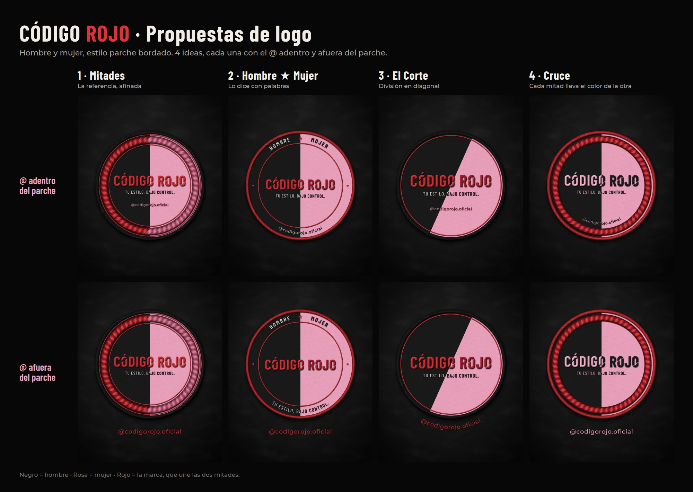
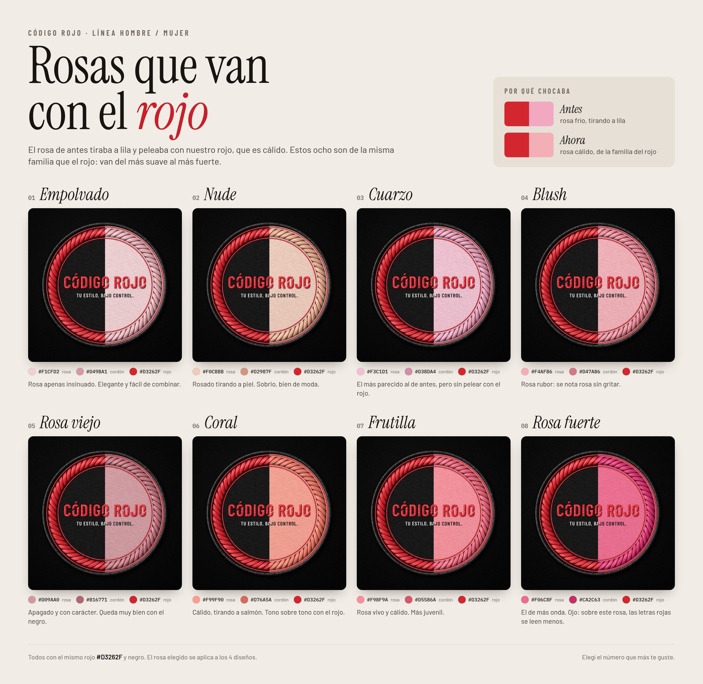

# Propuestas de logo: Código Rojo hombre / mujer



Lo que se pidió: mantener la onda de parche bordado de la referencia, que la
diferencia hombre / mujer se note y se entienda sin dejar de ser simple, y hacer
8 versiones: 4 con el `@codigorojo.oficial` adentro del parche y 4 afuera.

Son 4 ideas, cada una en las dos variantes del @, así se pueden comparar de a
pares. Todas comparten lo que ya funciona del logo actual: el wordmark
condensado con los cortes en diagonal de las "O" y la bajada
"TU ESTILO, BAJO CONTROL.".

**Colores:** negro = hombre · rosa = mujer · rojo = la marca, que une las dos
mitades.

| # | Concepto | Idea | @ adentro | @ afuera |
|---|---|---|---|---|
| 1 | **Mitades** | La referencia, afinada: mitad negra, mitad rosa, cordón rojo/rosa y el wordmark rojo cruzando las dos. | [ver](1-mitades-arroba-adentro.jpg) | [ver](1-mitades-arroba-afuera.jpg) |
| 2 | **Hombre ★ Mujer** | Insignia que lo dice con palabras: HOMBRE sobre la mitad negra, MUJER sobre la rosa. La más explícita. | [ver](2-hombre-mujer-arroba-adentro.jpg) | [ver](2-hombre-mujer-arroba-afuera.jpg) |
| 3 | **El Corte** | División en diagonal: más movimiento, más streetwear. Sin cordón y con el wordmark más grande. | [ver](3-el-corte-arroba-adentro.jpg) | [ver](3-el-corte-arroba-afuera.jpg) |
| 4 | **Cruce** | Cada mitad lleva el color de la otra en las letras (rosa sobre negro, negro sobre rosa); el borde y el cordón rojos abrazan a las dos. | [ver](4-cruce-arroba-adentro.jpg) | [ver](4-cruce-arroba-afuera.jpg) |

Las imágenes son de 1080 × 1350 (formato de posteo de Instagram), con el
parche apoyado sobre frisa negra como en la referencia.

## Segunda vuelta: el rosa



El rosa de la primera vuelta (`#F3A8C2`) no iba con el rojo: el rojo de la
marca es cálido (tono ≈ 25°) y ese rosa es frío, tira a lila (≈ 357°). En [`rosas/`](rosas/) hay 8 rosas de la misma familia que el
rojo, del más suave al más fuerte, aplicados al parche "Mitades" para
compararlos. `00-el-de-antes.jpg` es el anterior, para comparar.

| # | Rosa | Cordón | Onda |
|---|---|---|---|
| 01 | Empolvado `#F1CFD2` | `#D49BA1` | Apenas insinuado, elegante |
| 02 | Nude `#F0CBBB` | `#D2987F` | Tirando a piel, sobrio |
| 03 | Cuarzo `#F3C1D1` | `#D38DA4` | El más parecido al de antes, sin pelear con el rojo |
| 04 | Blush `#F4AFB6` | `#D47A86` | Rosa rubor, se nota sin gritar |
| 05 | Rosa viejo `#D09AA0` | `#B16771` | Apagado, con carácter |
| 06 | Coral `#F99F90` | `#D76A5A` | Cálido, tono sobre tono con el rojo |
| 07 | Frutilla `#F98F9A` | `#D5586A` | Vivo y cálido, más juvenil |
| 08 | Rosa fuerte `#F06C8F` | `#CA2C63` | El de más onda (las letras rojas se leen menos) |

Rojo de la marca `#D3262F`. Estas imágenes ya salen del render nuevo
(`generador/bordado/`): hilo con brillo según la dirección de la puntada,
relleno por filas, borde overlock y sombras, en vez del relieve plano de la
primera vuelta. El rosa que se elija se aplica a los 4 diseños.

## Antes de elegir: el tamaño del bordado

Como referencia, un texto bordado se lee bien con letras de 4 a 5 mm o más.
Medido sobre estos diseños:

| Texto | En un parche de 8 cm | De 10 cm | Diámetro para llegar a 4 mm |
|---|---|---|---|
| CÓDIGO ROJO | 7,6 mm | 9,5 mm | ~4 cm |
| TU ESTILO, BAJO CONTROL. | 2,3 mm | 2,9 mm | ~14 cm |
| @ adentro del parche | ~1,5 mm | ~2 mm | ~20 a 23 cm |

O sea: el @ adentro (y la bajada) funcionan en un parche grande de espalda o
en digital. Para el pecho (7–8 cm) conviene una versión reducida: solo
CÓDIGO ROJO con las dos mitades, y el @ afuera (bordado más grande en la
prenda, o estampado).

## Regenerar o sacar las versiones finales

Todo sale de `generador/` (el texto va convertido a curvas, las fuentes
Barlow Condensed y Montserrat son libres, licencia OFL):

```bash
cd branding/propuestas-logo/generador
npm install
npm run build            # las 8 JPG + comparativa.jpg en esta carpeta
npm run build -- --hd    # además PNG 2160x2700 y SVG en generador/salida-hd/
```

Si Playwright no encuentra su Chromium: `npx playwright install chromium`.

El render realista (el de los rosas) está en `generador/bordado/`, en Python.
Usa las mismas letras que el generador de arriba (las máscaras salen de
`lib.mjs`):

```bash
cd branding/propuestas-logo/generador
npm install
pip install -r bordado/requirements.txt
python3 bordado/rosas.py   # las 8 opciones + rosas.jpg en ../rosas/
```

Cuando se elija uno, desde acá salen las piezas finales: PNG sin fondo, versión
chica para el pecho, foto de perfil, logo para la web y una versión plana
(colores lisos) para pasarle al bordador.
